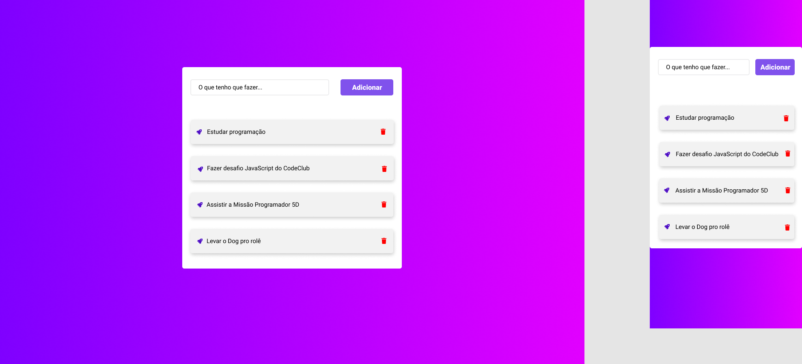

# To-do list
Task List, allowing you to mark tasks as completed, delete them, all data being stored in json localStorage , thus keeping your data always up to date.

<h3>Final result:</h3>

 
 

## Tasks performed:

- [x] creation HTML

- [x] Stylization CSS

- [x] Responsiveness

- [x] Updated data save

 
<a href="https://github.com/izabela-guimaraes/PlayStation-Store" 
target="blank"> See the application working </a>

<h5>To see another project <a href="https://github.com/izabela-guimaraes/PlayStation-Store" 
target="blank">click here</a></h5>

<a href="https://www.figma.com/file/w3KAgO5zsHYbjrfdvESuQE/todo-list---MP5D---1">Figma link</a>

🚀 Technologies

This project was developed with the following technologies:
 

-Html
 
-Css
 
-JavaScript
 
-Json localStorage

## 🤝  Contributors

We thank the following people who contributed to this project:

- Project developed through the Code Club course

<table>
  <tr>
    <td align="center">
      <a href="#">
         
        
          <b>Izabela Guimarães</b>
        
      </a>
    </td>
        <td align="center">
      <a href="#">
        
         
        
          <b>Code Club</b>
        
      </a>
    </td>
</table>

 
